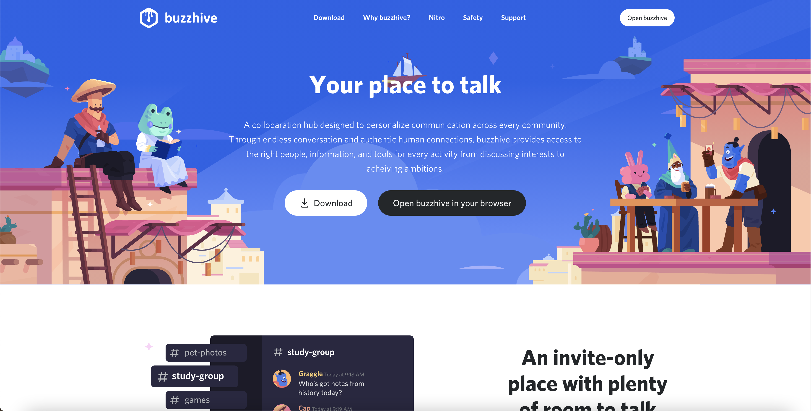
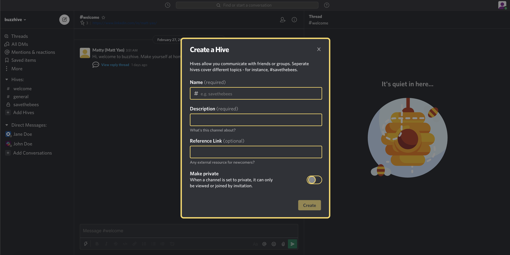

# README

[buzzhive](https://buzzhive.herokuapp.com/#/), a collaboration hub designed to personalize communication and collaboration across every community. Through endless conversation and authentic human connections, buzzhive provides access to the right people, information, and tools for every activity from discussing interests to achieving ambitions.


## Features


<br></br>

1. **New account creation, login, and guest login** 

    * Users can sign up, sign in, log out

    * Users can use a guest login to utilize the site

    * Users can't use certain features without logging in, such as channel messaging


<br></br>

2. **Chat through Channels and Threads**

    * View and post messages in channels that a user has access to

    * Reply to posted messages on accessible channels

    * View threads that branch from a specific channel message


<br></br>

3. **Create Hives (Channels)**

    * Create public and private Hives (Channels) and begin sending messages right away


<br></br>

4. **Search for a Hive**

    * Search for a Hive and jump straight to the Hive


<br></br>

## Technology Highlights

* In addition to the Ruby on Rails backend and React frontend, ActionCable, which employs the use
of WebSockets, was used to enable real-time channel features. The WebSocket communication cycle
was integated through all parts of the application, including the Rails controller and jBuilder
backend components and in the application's React frontend. Below is a snippet from the WebSocket
component integrated into the frontend that listens for certain actions in the backend. 

```rb
createSubscription() {
    App.cable.subscriptions.create(
        { channel: "HivesChannel", id: this.props.currentHiveId }, 
        {
            connected: () => {},
            received: (data) => {
                const message = data.message;
                if (message.parentMessageId === null) {
                    this.props.receiveMessage(message);
                }
            },
            disconnected: () => {}
        }
    );
};
```

* Another hurdle was rendering and obtaining the nested messages, which required recursive jBuilder
partials to send the JSON data to the React frontend, and recursive functional components on the React frontend side
to recursively render through the tree of nested messages. Below is a snippet of the jBuilder partial utilized to 
send a message thread to the React frontend.

```rb
# /views/messages/show.json.jbuilder
json.partial! 'message', message: @message
    json.set! :children do
        if @message.children.length > 0
            json.array! @message.children do |message|
                json.partial! 'show', message: message
            end
        else
            json.array!
        end
    end

# /views/messages/_show.json.jbuilder
json.partial! 'message', message: message 
    json.set! :children do
        if message.children.length > 0
            json.array! message.children do |message|
                json.partial! 'show', message: message
            end
        else
            json.array!
        end
    end
```

* The resulting data that is rendered by the React component is the formatted JSON below:

    ```js
    {
        "id": 1,
        "body": "Hello everyone. This is the first test message on Buzzhive.",
        "authorId": 14,
        "parentMessageId": null,
        "msgeableId": 2,
        "msgeableType": "Hive",
        "createdAt": "2021-02-27T09:29:13.787Z",
        "children": [
            {
            "id": 2,
            "body": "Ahoy there! Excited to be here!",
            "authorId": 6,
            "parentMessageId": 1,
            "msgeableId": 2,
            "msgeableType": "Hive",
            "createdAt": "2021-02-27T09:29:13.793Z",
            "children": [
                {
                "id": 3,
                "body": "Glad to have you aboard matey.",
                "authorId": 14,
                "parentMessageId": 2,
                "msgeableId": 2,
                "msgeableType": "Hive",
                "createdAt": "2021-02-27T09:29:13.797Z",
                "children": [
                    {
                    "id": 4,
                    "body": "This is awesome!",
                    "authorId": 12,
                    "parentMessageId": 3,
                    "msgeableId": 2,
                    "msgeableType": "Hive",
                    "createdAt": "2021-02-27T09:29:13.802Z",
                    "children": []
                    }
                ]
                },
                {
                "id": 9,
                "body": "Hey Anonymous Hare!",
                "authorId": 3,
                "parentMessageId": 2,
                "msgeableId": 2,
                "msgeableType": "Hive",
                "createdAt": "2021-02-27T09:29:13.835Z",
                "children": [
                    {
                    "id": 10,
                    "body": "Howdy Anonymous Hedgehog",
                    "authorId": 6,
                    "parentMessageId": 9,
                    "msgeableId": 2,
                    "msgeableType": "Hive",
                    "createdAt": "2021-02-27T09:29:13.840Z",
                    "children": []
                    }
                ]
                }
            ]
            }
        ]
    }
    ```
